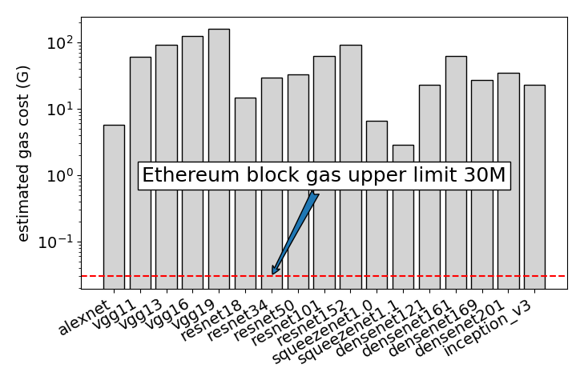
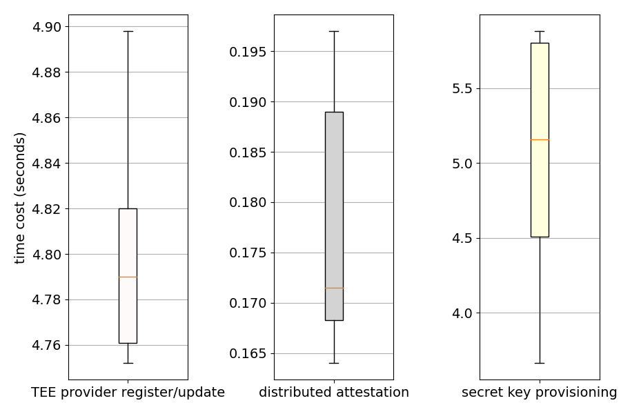
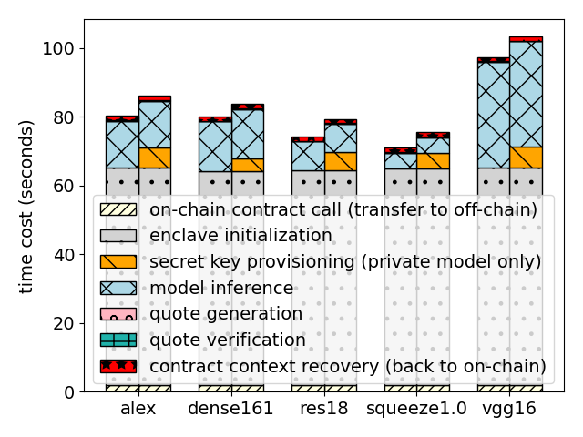

# Make Smart Contracts Smarter on Blockchain

## Directories

```
- client: the implementation of client
- console: run client as terminal
- dist: experiment figures and a small NFT study case
- eval_logs: raw experiment data
- fisco-smart: the implementation of blockchain nodes and precompiled contracts
- gramine: Graphene-SGX LibOS code
- quote-verification: scripts for extracting the SGX quote file
- tee-provider: the implementation of TEE provider
- *.sh: bash scripts to install dependencies and run the prototype
```

## Dependencies

- FISCO-BCOS `v3.0.0`
- gramine `v1.2`

## Tips and possible issues

- Switch source for faster compile

```bash
cat > ~/.gitconfig << EOF
[url "https://ghproxy.com/https://github.com/"]
        insteadOf = https://github.com/
[http]
        sslVerify = false
EOF
```

- console v3.0.0 has minor issues on calling precompiled contracts, the fixed method refers to [https://github.com/FISCO-BCOS/console/issues/601](https://github.com/FISCO-BCOS/console/issues/601).

## Evaluation

- estimated gas cost of model inference on-chain



- time cost of TEE register, distributed attestation, and secret provisioning



- time cost comparison in SMART and EVM-based on-chain solutions


- end-to-end latency of SMART framework


